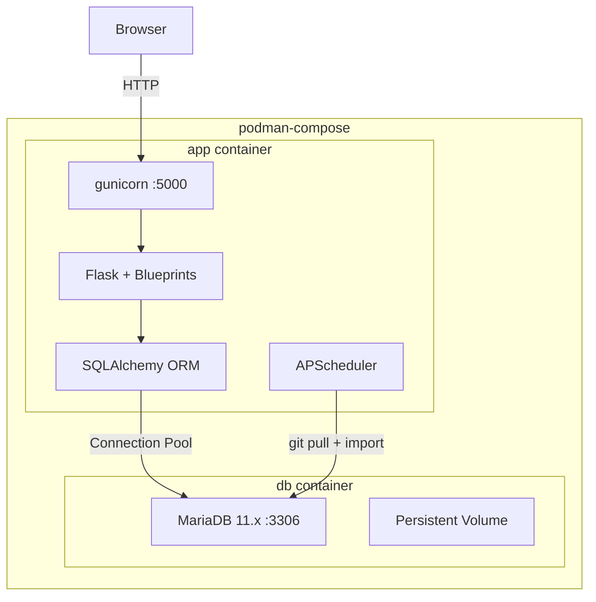
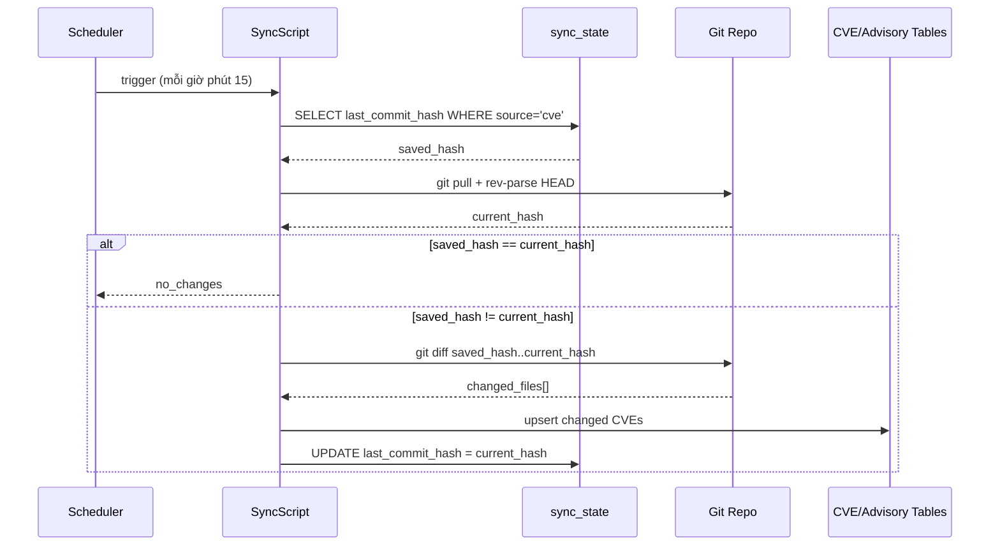

# Tài liệu Thiết kế — Secure Software Board

## Tổng quan

Secure Software Board là ứng dụng web Flask, tra cứu ~346,000 CVE và 1,300+ security advisories từ 27 nguồn. Sử dụng MariaDB làm database duy nhất, SQLAlchemy ORM cho data access, Flask Blueprints cho MVC routing.

## Kiến trúc



### Quyết định kiến trúc

| Quyết định | Lựa chọn | Lý do |
|---|---|---|
| ORM | SQLAlchemy 2.x | Type-safe queries, relationship loading, migration support, no raw SQL |
| Database | MariaDB 11.x only | Production-grade, no SQLite fallback needed |
| Connection pool | SQLAlchemy engine pool | Built-in, configurable pool_size/max_overflow |
| WSGI | gunicorn 4 workers | Production-grade |
| Container | podman-compose | Portable, rootless |
| Scheduler | APScheduler | Background sync mỗi giờ phút 15 |

## Cấu trúc MVC

```
src/
├── app.py              # App factory (create_app)
├── config.py           # Configuration (DB URL, etc.)
├── database.py         # SQLAlchemy engine, session, Base
├── filters.py          # Jinja2 template filters
├── scheduler.py        # APScheduler setup
├── safe_version.py     # Safe version business logic
├── models/             # SQLAlchemy ORM Models
│   ├── __init__.py     # Export all models
│   ├── cve.py          # Cve, AffectedProduct, CvssScore, CweEntry, Reference
│   ├── advisory.py     # SecurityAdvisory, AdvisoryAffectedProduct, AdvisoryCve, AdvisoryReference
│   └── queries.py      # Complex query functions (pagination, stats, search)
├── controllers/        # Flask Blueprints
│   ├── __init__.py
│   ├── main.py         # Homepage
│   ├── cves.py         # /cves, /cves/<id>
│   ├── browse.py       # /cves/by-date, by-type, by-severity, /assigners
│   ├── vendors.py      # /vendors
│   ├── products.py     # /products, versions, fixed
│   ├── search.py       # /search
│   ├── advisories.py   # /advisories
│   └── api.py          # /api/sync/status
├── templates/
└── static/
```

## SQLAlchemy Models

### Cve

```python
class Cve(Base):
    __tablename__ = 'cves'
    cve_id = Column(String(30), primary_key=True)
    state = Column(String(20))
    assigner_org_id = Column(String(100))
    assigner_short_name = Column(String(100), index=True)
    date_reserved = Column(String(30))
    date_published = Column(String(30), index=True)
    date_updated = Column(String(30))
    description = Column(Text)
    severity = Column(String(20), index=True)
    data_version = Column(String(20))

    affected_products = relationship('AffectedProduct', back_populates='cve', cascade='all,delete')
    cvss_scores = relationship('CvssScore', back_populates='cve', cascade='all,delete')
    cwe_entries = relationship('CweEntry', back_populates='cve', cascade='all,delete')
    references = relationship('Reference', back_populates='cve', cascade='all,delete')
```

### AffectedProduct

```python
class AffectedProduct(Base):
    __tablename__ = 'affected_products'
    id = Column(BigInteger, primary_key=True, autoincrement=True)
    cve_id = Column(String(30), ForeignKey('cves.cve_id', ondelete='CASCADE'), index=True)
    vendor = Column(String(500), index=True)
    product = Column(Text)           # TEXT — dữ liệu thực tế lên tới 2048 chars
    platform = Column(Text)          # TEXT — dữ liệu thực tế lên tới 1903 chars
    version_start = Column(Text)     # TEXT — dữ liệu thực tế lên tới 1024 chars
    version_end = Column(Text)       # TEXT — dữ liệu thực tế lên tới 780 chars
    version_exact = Column(Text)     # TEXT — dữ liệu thực tế lên tới 1024 chars
    default_status = Column(String(50))
    status = Column(String(50))
    version_end_type = Column(String(30))

    cve = relationship('Cve', back_populates='affected_products')
```

> **Ghi chú schema**: Các cột `product`, `platform`, `version_start`, `version_end`, `version_exact` dùng TEXT thay vì VARCHAR vì dữ liệu CVE thực tế từ cvelistV5 có giá trị vượt 255 ký tự (max product: 2048, max platform: 1903, max version_start: 1024). Index trên `product` dùng prefix 500 bytes.

### CvssScore, CweEntry, Reference

```python
class CvssScore(Base):
    __tablename__ = 'cvss_scores'
    id = Column(BigInteger, primary_key=True, autoincrement=True)
    cve_id = Column(String(30), ForeignKey('cves.cve_id', ondelete='CASCADE'), index=True)
    version = Column(String(10))
    vector_string = Column(String(255))
    base_score = Column(Numeric(4,1), index=True)
    base_severity = Column(String(20))
    attack_vector = Column(String(30))
    attack_complexity = Column(String(30))
    privileges_required = Column(String(30))
    user_interaction = Column(String(30))
    scope = Column(String(30))
    confidentiality_impact = Column(String(30))
    integrity_impact = Column(String(30))
    availability_impact = Column(String(30))
    source = Column(String(50), default='cna')
    cve = relationship('Cve', back_populates='cvss_scores')

class CweEntry(Base):
    __tablename__ = 'cwe_entries'
    id = Column(BigInteger, primary_key=True, autoincrement=True)
    cve_id = Column(String(30), ForeignKey('cves.cve_id', ondelete='CASCADE'), index=True)
    cwe_id = Column(String(30), index=True)
    description = Column(Text)
    cve = relationship('Cve', back_populates='cwe_entries')

class Reference(Base):
    __tablename__ = 'references_table'
    id = Column(BigInteger, primary_key=True, autoincrement=True)
    cve_id = Column(String(30), ForeignKey('cves.cve_id', ondelete='CASCADE'), index=True)
    url = Column(Text)
    tags = Column(Text)
    cve = relationship('Cve', back_populates='references')
```

### Advisory Models

```python
class SecurityAdvisory(Base):
    __tablename__ = 'security_advisories'
    id = Column(String(255), primary_key=True)
    source = Column(String(50), index=True)
    title = Column(Text)
    description = Column(Text)
    severity = Column(String(20), index=True)
    cvss_score = Column(Numeric(4,1))
    cvss_vector = Column(String(255))
    published_date = Column(String(50), index=True)
    modified_date = Column(String(50))
    url = Column(Text)
    vendor = Column(String(100))   # Top-level vendor/ecosystem từ advisory JSON
    solution = Column(Text)
    json_file = Column(String(500))

    affected_products = relationship('AdvisoryAffectedProduct', back_populates='advisory', cascade='all,delete')
    cves = relationship('AdvisoryCve', back_populates='advisory', cascade='all,delete')
    references = relationship('AdvisoryReference', back_populates='advisory', cascade='all,delete')

class AdvisoryAffectedProduct(Base):
    __tablename__ = 'advisory_affected_products'
    id = Column(BigInteger, primary_key=True, autoincrement=True)
    advisory_id = Column(String(255), ForeignKey('security_advisories.id', ondelete='CASCADE'), index=True)
    vendor = Column(String(500), index=True)       # Trực tiếp từ advisory JSON
    product = Column(String(2048))                  # Trực tiếp từ advisory JSON
    version_range = Column(String(500))
    fixed_version = Column(String(500))
    advisory = relationship('SecurityAdvisory', back_populates='affected_products')

class AdvisoryCve(Base):
    __tablename__ = 'advisory_cves'
    id = Column(BigInteger, primary_key=True, autoincrement=True)
    advisory_id = Column(String(255), ForeignKey('security_advisories.id', ondelete='CASCADE'), index=True)
    cve_id = Column(String(30), index=True)
    advisory = relationship('SecurityAdvisory', back_populates='cves')

class AdvisoryReference(Base):
    __tablename__ = 'advisory_references'
    id = Column(BigInteger, primary_key=True, autoincrement=True)
    advisory_id = Column(String(255), ForeignKey('security_advisories.id', ondelete='CASCADE'), index=True)
    url = Column(Text)
    advisory = relationship('SecurityAdvisory', back_populates='references')
```

### SyncState

```python
class SyncState(Base):
    __tablename__ = 'sync_state'
    source = Column(String(50), primary_key=True)       # 'cve' hoặc 'advisory'
    last_commit_hash = Column(String(64))                # Git commit hash lần sync gần nhất
    last_sync_time = Column(String(50))                  # ISO timestamp
    files_changed = Column(Integer, default=0)
    records_updated = Column(Integer, default=0)
    status = Column(String(20), default='success')       # success, error, no_changes, initial_import
```

## Sync Flow



## Database Connection

```python
# database.py
from sqlalchemy import create_engine
from sqlalchemy.orm import sessionmaker, scoped_session, DeclarativeBase

class Base(DeclarativeBase):
    pass

engine = create_engine(
    'mysql+pymysql://{user}:{password}@{host}:{port}/{database}?charset=utf8mb4',
    pool_size=10, max_overflow=20, pool_recycle=3600
)
Session = scoped_session(sessionmaker(bind=engine))
```

## Query Pattern (models/queries.py)

```python
def get_paginated(query, page, per_page=50):
    """Standard pagination wrapper for SQLAlchemy queries."""
    total = query.count()
    pages = max(ceil(total / per_page), 1)
    page = max(1, min(page, pages))
    items = query.offset((page-1) * per_page).limit(per_page).all()
    return {'items': items, 'total': total, 'page': page, 'pages': pages, 'per_page': per_page}

# Example usage:
def get_cves(session, page, year=None, severity=None):
    q = session.query(Cve).filter(Cve.state == 'PUBLISHED')
    if year:
        q = q.filter(Cve.date_published.like(f'{year}%'))
    if severity:
        q = q.filter(Cve.severity == severity)
    q = q.order_by(Cve.date_published.desc())
    return get_paginated(q, page)
```

## Sidebar Menu Order

Search → Software Secure Version (Products, Vendors) → Advisories → Vulnerabilities

## Container Deployment

```yaml
# docker-compose.yml
services:
  app:
    build: .
    ports: ["5005:5000"]
    environment:
      DATABASE_URL: mysql+pymysql://cvedb:cvedb@db:3306/cve_database?charset=utf8mb4
    depends_on:
      db: { condition: service_healthy }
  db:
    image: mariadb:11
    environment:
      MARIADB_ROOT_PASSWORD: rootpass
      MARIADB_DATABASE: cve_database
      MARIADB_USER: cvedb
      MARIADB_PASSWORD: cvedb
    volumes: [mariadb_data:/var/lib/mysql]
    healthcheck:
      test: ["CMD", "healthcheck.sh", "--connect"]
```
