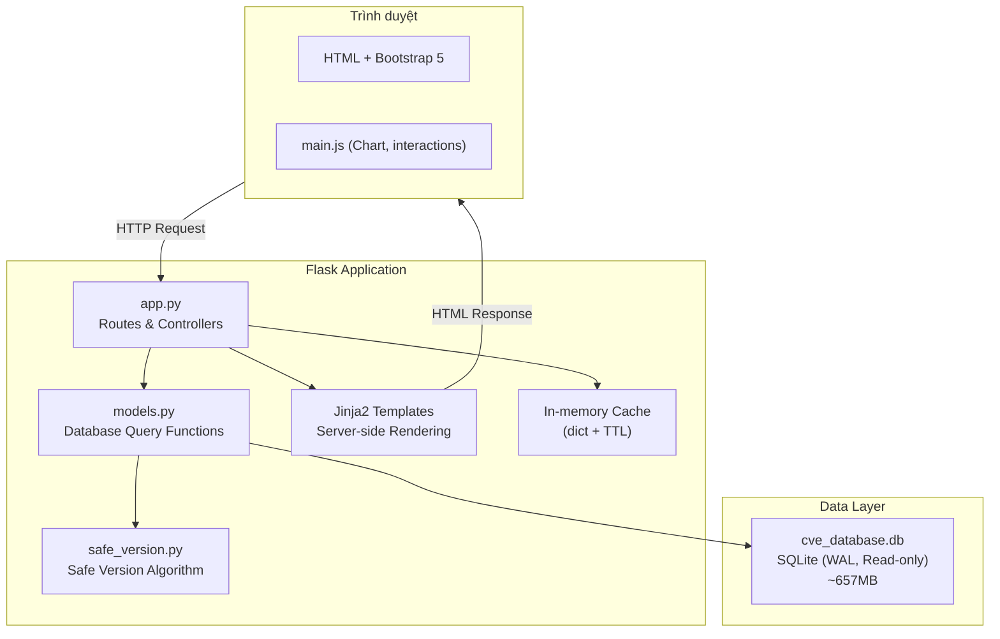
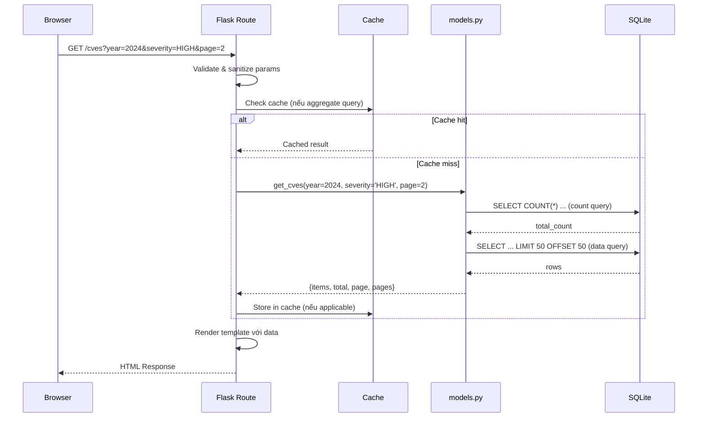
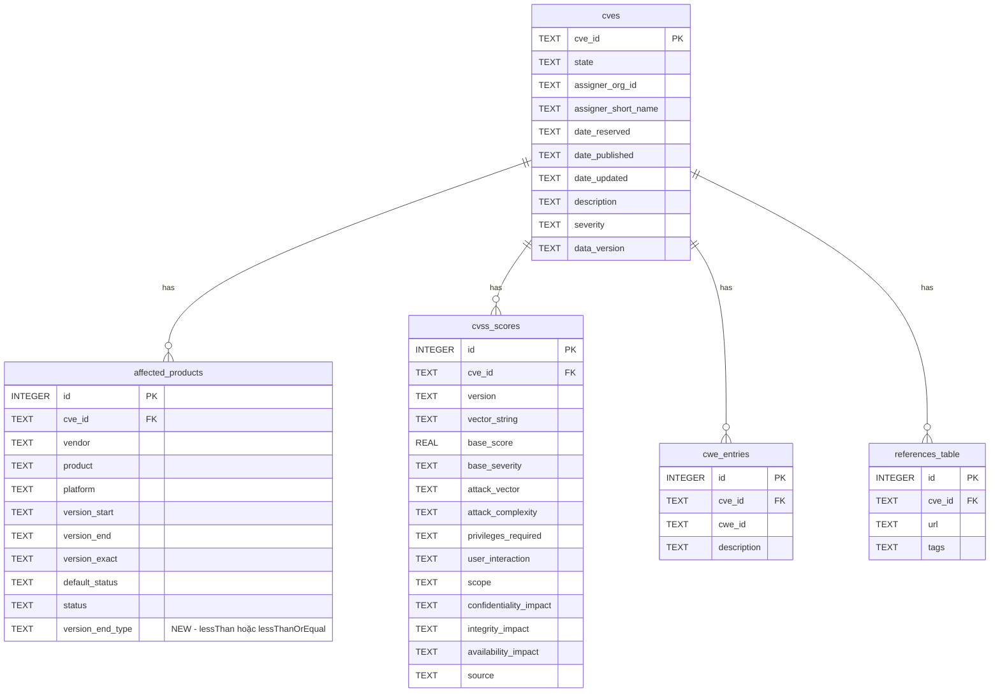
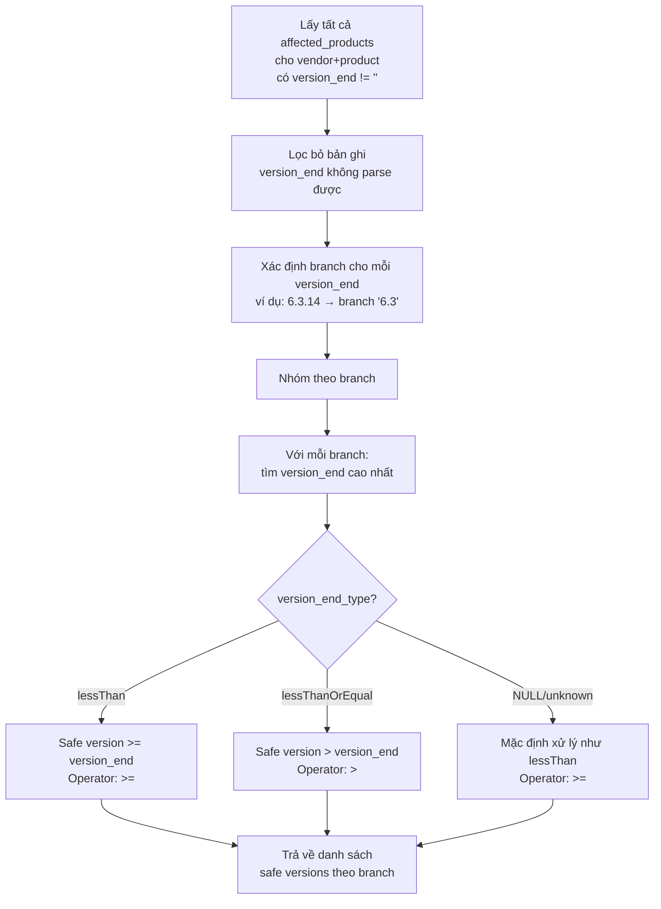

# Tài liệu Thiết kế — Website Cơ sở dữ liệu CVE

## Tổng quan

Website CVE Database là ứng dụng web Flask server-side rendering, cho phép tra cứu ~346,000 lỗ hổng bảo mật (CVE) từ cơ sở dữ liệu SQLite 657MB đã được import sẵn. Ứng dụng cung cấp nhiều góc nhìn duyệt dữ liệu (theo vendor, product, severity, CWE, ngày, assigner), tìm kiếm với wildcard, và tính năng gợi ý phiên bản an toàn dựa trên phân tích version range từ dữ liệu CVE.

Kiến trúc tuân theo mô hình MVC đơn giản: Flask routes (Controller) → models.py (Model) → Jinja2 templates (View), với SQLite read-only làm data store. Không sử dụng ORM — truy vấn SQL trực tiếp qua module `sqlite3` để tối ưu hiệu năng trên dataset lớn.

## Kiến trúc

### Sơ đồ kiến trúc tổng thể



### Luồng xử lý Request



### Quyết định kiến trúc

| Quyết định | Lựa chọn | Lý do |
|---|---|---|
| Không dùng ORM | Raw SQL qua sqlite3 | Dataset lớn (346K CVE, 1.1M products), cần kiểm soát query chính xác, tận dụng index có sẵn |
| Server-side rendering | Jinja2 + Bootstrap 5 | Đơn giản, SEO-friendly, không cần API riêng cho SPA |
| In-memory cache | Dict + TTL tự implement | Đơn giản, đủ cho single-process Flask, không cần Redis |
| Read-only SQLite + WAL | `file:cve_database.db?mode=ro` + WAL | Dữ liệu tĩnh (import 1 lần), WAL cho phép đọc đồng thời |
| Safe version tách module riêng | `safe_version.py` | Logic phức tạp (semver comparison, branch grouping), dễ test độc lập |

## Thành phần và Giao diện

### 1. `app.py` — Flask Application & Routes

Chịu trách nhiệm: khởi tạo Flask app, quản lý database connection, định nghĩa routes, xử lý lỗi.

```python
# Khởi tạo
app = Flask(__name__)

def get_db() -> sqlite3.Connection:
    """Lấy database connection cho request hiện tại (stored in g)."""

def close_db(exception=None):
    """Đóng connection khi request kết thúc."""

# Routes
@app.route('/')                              # Homepage
@app.route('/cves')                          # CVE list + filters
@app.route('/cves/<cve_id>')                 # CVE detail
@app.route('/cves/by-date')                  # Browse by date
@app.route('/cves/by-type')                  # Browse by CWE
@app.route('/cves/by-severity')              # Browse by severity
@app.route('/assigners')                     # Assigners list
@app.route('/assigners/<assigner>')          # Assigner detail
@app.route('/vendors')                       # Vendors A-Z
@app.route('/vendors/<vendor>')              # Vendor detail
@app.route('/products')                      # Products browse
@app.route('/products/<vendor>/<product>')   # Product detail + safe version
@app.route('/search')                        # Search

# Error handlers
@app.errorhandler(404)
@app.errorhandler(500)
```

### 2. `models.py` — Database Query Functions

Mỗi hàm nhận `db` connection và trả về dict/list. Tất cả hàm danh sách trả về format chuẩn:

```python
def get_paginated_result(db, query, count_query, params, page, per_page=50) -> dict:
    """
    Returns: {
        'items': list[dict],    # Dữ liệu trang hiện tại
        'total': int,           # Tổng số bản ghi
        'page': int,            # Trang hiện tại
        'pages': int,           # Tổng số trang
        'per_page': int         # Số bản ghi mỗi trang
    }
    """

# Homepage
def get_stats(db) -> dict                    # Thống kê tổng quan
def get_latest_cves(db, limit=10) -> list    # CVE mới nhất

# CVE
def get_cves(db, page, year, severity) -> dict
def get_cve_detail(db, cve_id) -> dict | None
def get_cve_cvss(db, cve_id) -> list
def get_cve_affected(db, cve_id) -> list
def get_cve_cwes(db, cve_id) -> list
def get_cve_references(db, cve_id) -> list

# Browse
def get_years_with_counts(db) -> list
def get_months_for_year(db, year) -> list
def get_cves_by_month(db, year, month, page) -> dict
def get_cwe_types(db, page) -> dict
def get_cves_by_cwe(db, cwe_id, page) -> dict
def get_severity_summary(db) -> list
def get_cves_by_severity(db, severity, page) -> dict
def get_assigners(db, page) -> dict
def get_cves_by_assigner(db, assigner, page) -> dict

# Vendor & Product
def get_vendors(db, letter, search, page) -> dict
def get_vendor_detail(db, vendor) -> dict | None
def get_vendor_products(db, vendor, page) -> dict
def get_products(db, search, page) -> dict
def get_product_detail(db, vendor, product) -> dict | None
def get_product_cves(db, vendor, product, page) -> dict

# Search
def search_cves(db, cve_id, keyword, vendor, product, page) -> dict
```

### 3. `safe_version.py` — Module Gợi ý Phiên bản An toàn

```python
def parse_version(version_str: str) -> tuple[int, ...] | None:
    """Parse version string thành tuple số. Trả về None nếu không parse được."""

def compare_versions(v1: str, v2: str) -> int:
    """So sánh 2 version strings. Returns: -1, 0, 1."""

def get_version_branch(version_str: str) -> str:
    """Xác định nhánh phiên bản (ví dụ: '6.3.14' → '6.3')."""

def compute_safe_versions(version_ranges: list[dict]) -> list[dict]:
    """
    Input: [{'version_end': '6.3.14', 'version_end_type': 'lessThan', 'cve_id': '...'}]
    Output: [{'branch': '6.3', 'safe_version': '6.3.14', 'operator': '>=', 'cve_count': 5}]
    """
```

### 4. Templates

#### Base Layout (`base.html`)

```
┌─────────────────────────────────────────────────┐
│ Header: CVE Database                    [Search] │
├──────────┬──────────────────────────────────────┤
│ Sidebar  │                                      │
│          │  Content Area                        │
│ Vulns    │     │
│ ├ Browse │                                      │
│ ├ By Date│                                      │
│ ├ By Type│                                      │
│ ├ Severity                                      │
│ ├ Assigners                                     │
│          │                                      │
│ Software │                                      │
│ ├ Vendors│                                      │
│ ├Products│                                      │
│          │                                      │
│ Search   │                                      │
└──────────┴──────────────────────────────────────┘
```

#### Component Templates

- `components/sidebar.html` — Sidebar navigation, nhận `active_page` để highlight
- `components/pagination.html` — Pagination component, nhận `pagination` dict
- `components/cvss_badge.html` — CVSS score badge với color mapping

### 5. Cache Layer

```python
class SimpleCache:
    """In-memory cache với TTL."""
    def __init__(self):
        self._cache: dict[str, tuple[float, Any]] = {}

    def get(self, key: str) -> Any | None:
        """Trả về cached value nếu chưa hết TTL, None nếu miss."""

    def set(self, key: str, value: Any, ttl: int = 3600):
        """Lưu value với TTL (giây)."""
```

Các key được cache:
- `stats` — Thống kê trang chủ (TTL: 1 giờ)
- `years_counts` — Danh sách năm + số lượng (TTL: 1 giờ)
- `severity_summary` — Phân bố severity (TTL: 1 giờ)
- `cwe_types_page_{n}` — Danh sách CWE (TTL: 1 giờ)

## Mô hình Dữ liệu

### Sơ đồ ERD



### Thay đổi Schema cho Safe Version

Cần thêm cột `version_end_type` vào bảng `affected_products`:

```sql
ALTER TABLE affected_products ADD COLUMN version_end_type TEXT;
```

Cập nhật import script để populate cột mới:
- Khi JSON có trường `lessThan` → `version_end_type = 'lessThan'`
- Khi JSON có trường `lessThanOrEqual` → `version_end_type = 'lessThanOrEqual'`

### Index có sẵn (không cần tạo thêm)

| Table | Index | Columns |
|---|---|---|
| cves | idx_cves_state | state |
| cves | idx_cves_date_published | date_published |
| cves | idx_cves_severity | severity |
| cves | idx_cves_assigner | assigner_short_name |
| affected_products | idx_affected_vendor | vendor |
| affected_products | idx_affected_product | product |
| affected_products | idx_affected_vendor_product | vendor, product |
| affected_products | idx_affected_cve | cve_id |
| cvss_scores | idx_cvss_cve | cve_id |
| cvss_scores | idx_cvss_score | base_score |
| cwe_entries | idx_cwe_cve | cve_id |
| cwe_entries | idx_cwe_id | cwe_id |

### Thuật toán Safe Version Suggestion




#### Chi tiết thuật toán

1. **Parse version**: Tách chuỗi version theo dấu `.`, chuyển mỗi phần thành số nguyên. Ví dụ: `"6.3.14"` → `(6, 3, 14)`. Nếu bất kỳ phần nào không phải số, trả về `None` (bỏ qua bản ghi).

2. **Xác định branch**: Lấy tất cả các phần trừ phần cuối. Ví dụ: `"6.3.14"` → branch `"6.3"`, `"2.4.54"` → branch `"2.4"`. Với version chỉ có 1 phần (ví dụ: `"5"`), branch là `"*"` (root).

3. **Nhóm và tìm max**: Trong mỗi branch, so sánh tất cả `version_end` bằng tuple comparison, lấy giá trị cao nhất cùng `version_end_type` tương ứng.

4. **Xác định operator**:
   - `lessThan`: phiên bản `version_end` KHÔNG bị ảnh hưởng → gợi ý `>= version_end`
   - `lessThanOrEqual`: phiên bản `version_end` CÒN bị ảnh hưởng → gợi ý `> version_end`

5. **Ví dụ cụ thể**:
   - Product "Apache HTTP Server" có CVE với `version_end = "2.4.54"`, `version_end_type = "lessThan"`
   - Branch: `"2.4"`, Safe version: `>= 2.4.54`
   - Nghĩa là: phiên bản 2.4.54 trở lên là an toàn

### Wildcard Search

Chuyển đổi wildcard từ user input sang SQL LIKE:
- `*` → `%` (nhiều ký tự bất kỳ)
- Input được sanitize: escape `%` và `_` có sẵn trong input trước khi chuyển `*`
- Nếu không có wildcard, tự động thêm `%` ở đầu và cuối (contains search)

### CVSS Badge Color Mapping

| Score Range | Severity | Màu CSS |
|---|---|---|
| 9.0 – 10.0 | CRITICAL | `#d32f2f` (đỏ) |
| 7.0 – 8.9 | HIGH | `#f57c00` (cam) |
| 4.0 – 6.9 | MEDIUM | `#fbc02d` (vàng) |
| 0.1 – 3.9 | LOW | `#388e3c` (xanh lá) |
| N/A | N/A | `#757575` (xám) |

## Correctness Properties

*Một property là một đặc tính hoặc hành vi phải đúng trong mọi lần thực thi hợp lệ của hệ thống — về bản chất là một phát biểu hình thức về những gì hệ thống phải làm. Properties đóng vai trò cầu nối giữa đặc tả dễ đọc cho con người và đảm bảo tính đúng đắn có thể kiểm chứng bằng máy.*

### Property 1: Pagination invariant

*For any* valid page number `p` và tổng số bản ghi `total`, hàm phân trang phải trả về tối đa `per_page` (50) bản ghi, offset đúng bằng `(p - 1) * per_page`, và `pages = ceil(total / per_page)`.

**Validates: Requirements 4.2, 7.3, 9.3, 10.4, 11.3, 13.3, 14.5**

### Property 2: Year filter correctness

*For any* năm `y` được chọn làm bộ lọc, tất cả CVE trả về phải có `date_published` bắt đầu bằng `y` (tức nằm trong năm đó).

**Validates: Requirements 4.3**

### Property 3: Severity filter correctness

*For any* mức severity `s` được chọn (CRITICAL, HIGH, MEDIUM, LOW), tất cả CVE trả về phải có trường `severity` bằng chính xác `s`.

**Validates: Requirements 4.4, 8.2**

### Property 4: Combined filter AND logic

*For any* tổ hợp bộ lọc `{year, severity}`, tất cả CVE trả về phải thỏa mãn đồng thời cả hai điều kiện: `date_published` trong năm đó VÀ `severity` bằng giá trị đó.

**Validates: Requirements 4.5**

### Property 5: Date sort order invariant

*For any* danh sách CVE trả về từ query mặc định, dãy `date_published` phải giảm dần (mỗi phần tử ≥ phần tử tiếp theo theo thứ tự lexicographic).

**Validates: Requirements 4.6**

### Property 6: CWE filter correctness

*For any* CWE ID `c` được chọn, tất cả CVE trả về phải có ít nhất một bản ghi trong `cwe_entries` với `cwe_id = c`.

**Validates: Requirements 7.2**

### Property 7: Count-based sort order invariant

*For any* danh sách CWE types hoặc assigners trả về, dãy `cve_count` phải giảm dần (mỗi phần tử ≥ phần tử tiếp theo).

**Validates: Requirements 7.1, 9.1**

### Property 8: Assigner filter correctness

*For any* assigner `a` được chọn, tất cả CVE trả về phải có `assigner_short_name = a`.

**Validates: Requirements 9.2**

### Property 9: Letter filter correctness

*For any* ký tự `ch` trong A-Z hoặc 0-9, tất cả vendor trả về phải có tên bắt đầu bằng `ch` (case-insensitive).

**Validates: Requirements 10.2**

### Property 10: Wildcard search correctness

*For any* chuỗi tìm kiếm `q` chứa wildcard `*`, sau khi chuyển `*` thành `%`, tất cả kết quả trả về (vendor hoặc product) phải match pattern SQL LIKE tương ứng.

**Validates: Requirements 10.5, 12.2, 14.4**

### Property 11: Vendor exclusion invariant

*For any* truy vấn vendor (bất kể letter hay search), không bản ghi nào trong kết quả có tên vendor là `"n/a"`, rỗng, hoặc NULL.

**Validates: Requirements 10.6**

### Property 12: Product CVE association

*For any* product `(vendor, product)`, tất cả CVE trả về trong trang product detail phải có ít nhất một bản ghi trong `affected_products` với `vendor` và `product` tương ứng.

**Validates: Requirements 13.2**

### Property 13: Description keyword search

*For any* từ khóa `k` tìm kiếm trong description, tất cả CVE trả về phải có trường `description` chứa `k` (case-insensitive).

**Validates: Requirements 14.3**

### Property 14: CVSS badge color mapping

*For any* điểm CVSS `score` trong khoảng [0.0, 10.0], hàm badge phải trả về đúng severity label và màu sắc: CRITICAL (đỏ) cho 9.0-10.0, HIGH (cam) cho 7.0-8.9, MEDIUM (vàng) cho 4.0-6.9, LOW (xanh lá) cho 0.1-3.9.

**Validates: Requirements 15.1**

### Property 15: Invalid parameter defaults

*For any* giá trị tham số không hợp lệ (page ≤ 0, page không phải số, severity không hợp lệ), hệ thống phải sử dụng giá trị mặc định (page=1, severity=None) thay vì trả về lỗi.

**Validates: Requirements 17.3**

### Property 16: Version end type parsing round-trip

*For any* CVE JSON record có trường `lessThan` hoặc `lessThanOrEqual`, sau khi import, bản ghi tương ứng trong `affected_products` phải có `version_end_type` đúng là `'lessThan'` hoặc `'lessThanOrEqual'`.

**Validates: Requirements 18.2**

### Property 17: Safe version highest bound

*For any* tập hợp version ranges trong cùng một branch, phiên bản an toàn được gợi ý phải dựa trên `version_end` cao nhất (theo semver comparison) trong branch đó.

**Validates: Requirements 18.4**

### Property 18: Safe version boundary interpretation

*For any* `version_end` với `version_end_type = 'lessThan'`, phiên bản gợi ý phải có operator `>=`. *For any* `version_end` với `version_end_type = 'lessThanOrEqual'`, phiên bản gợi ý phải có operator `>`.

**Validates: Requirements 18.5, 18.6**

### Property 19: Semver comparison total order

*For any* ba version strings hợp lệ `a`, `b`, `c`, hàm `compare_versions` phải thỏa mãn: (1) antisymmetric: nếu `a ≤ b` và `b ≤ a` thì `a = b`, (2) transitive: nếu `a ≤ b` và `b ≤ c` thì `a ≤ c`, (3) total: hoặc `a ≤ b` hoặc `b ≤ a`.

**Validates: Requirements 18.7**

### Property 20: Unparseable version resilience

*For any* chuỗi version không thể parse thành các thành phần số (chứa chữ cái, ký tự đặc biệt, rỗng), hàm `compute_safe_versions` phải bỏ qua bản ghi đó mà không raise exception, và kết quả cuối cùng vẫn hợp lệ.

**Validates: Requirements 18.8**

### Property 21: Version branch grouping

*For any* tập hợp version strings hợp lệ, hai version có cùng prefix (tất cả phần trừ phần cuối) phải được nhóm vào cùng một branch, và hai version có prefix khác nhau phải ở branch khác nhau.

**Validates: Requirements 18.9**

## Xử lý Lỗi

### Chiến lược xử lý lỗi theo tầng

| Tầng | Loại lỗi | Xử lý |
|---|---|---|
| Route | Tham số không hợp lệ (page, severity) | Sử dụng giá trị mặc định, không trả lỗi |
| Route | Resource không tìm thấy (CVE, vendor, product) | Trả về trang 404 tùy chỉnh |
| Model | Database query lỗi | Log error, raise để Flask xử lý 500 |
| Model | Dữ liệu NULL/thiếu | Trả về giá trị mặc định (empty string, 0, []) |
| App | Database file không tồn tại | Trang lỗi với thông báo rõ ràng |
| App | Lỗi không xác định | Trang 500 tùy chỉnh, không tiết lộ chi tiết kỹ thuật |
| Safe Version | Version string không parse được | Bỏ qua bản ghi, tiếp tục xử lý |
| Safe Version | Không có dữ liệu version range | Hiển thị thông báo "Không đủ dữ liệu" |

### Validation tham số đầu vào

```python
def sanitize_page(page_str: str | None) -> int:
    """Chuyển page string thành int >= 1. Mặc định: 1."""

def sanitize_severity(severity: str | None) -> str | None:
    """Chỉ chấp nhận CRITICAL/HIGH/MEDIUM/LOW. Khác: None."""

def sanitize_year(year: str | None) -> int | None:
    """Chỉ chấp nhận năm 1999-2099. Khác: None."""

def sanitize_search(query: str | None) -> str:
    """Escape SQL special chars, chuyển * thành %. Max 200 ký tự."""
```

## Chiến lược Testing

### Dual Testing Approach

#### 1. Unit Tests (Example-based)

Sử dụng `pytest` + Flask test client.

- **Route tests**: Kiểm tra mỗi route trả về status code đúng, template đúng, dữ liệu đúng
- **Model tests**: Kiểm tra mỗi hàm query với dữ liệu cụ thể trong test database
- **Error handling tests**: Kiểm tra 404, 500, invalid params
- **Edge cases**: CVE không tồn tại, vendor "n/a", empty search, page=0

#### 2. Property-Based Tests

Sử dụng `hypothesis` (Python PBT library).

Mỗi property test chạy tối thiểu **100 iterations** với input ngẫu nhiên.

Mỗi test được tag theo format:
```python
# Feature: cve-database-website, Property {N}: {property_text}
```

**Các property tests cần implement:**

| Property | Module được test | Loại input sinh ngẫu nhiên |
|---|---|---|
| 1: Pagination | `models.get_paginated_result` | page (1-1000), total (0-100000) |
| 2: Year filter | `models.get_cves` | year (1999-2025) |
| 3: Severity filter | `models.get_cves` | severity (CRITICAL/HIGH/MEDIUM/LOW) |
| 4: Combined filter | `models.get_cves` | year + severity combinations |
| 5: Date sort | `models.get_cves` | Bất kỳ query params |
| 6: CWE filter | `models.get_cves_by_cwe` | cwe_id từ database |
| 7: Count sort | `models.get_cwe_types`, `get_assigners` | page numbers |
| 8: Assigner filter | `models.get_cves_by_assigner` | assigner names |
| 9: Letter filter | `models.get_vendors` | letter (A-Z, 0-9) |
| 10: Wildcard search | `models.get_vendors`, `get_products` | search strings với * |
| 11: Vendor exclusion | `models.get_vendors` | Bất kỳ letter/search |
| 12: Product CVE | `models.get_product_cves` | vendor+product pairs |
| 13: Keyword search | `models.search_cves` | random keywords |
| 14: CVSS badge | `cvss_badge` helper | float (0.0-10.0) |
| 15: Invalid params | `sanitize_*` functions | Random strings, negative numbers |
| 16: Version end type | Import logic | JSON records với lessThan/lessThanOrEqual |
| 17: Safe version bound | `compute_safe_versions` | Lists of version ranges |
| 18: Boundary interpretation | `compute_safe_versions` | version_end + type combinations |
| 19: Semver comparison | `compare_versions` | Pairs/triples of version strings |
| 20: Unparseable version | `compute_safe_versions` | Mixed valid/invalid version strings |
| 21: Branch grouping | `get_version_branch` | Random version strings |

#### 3. Integration Tests

- Flask test client gọi routes thực tế với test database
- Kiểm tra HTML response chứa đúng elements
- Kiểm tra cache behavior (hit/miss/TTL)

### Test Database

Tạo test fixture với SQLite in-memory database chứa ~100 CVE records đại diện, đủ để test tất cả scenarios mà không cần database 657MB.
