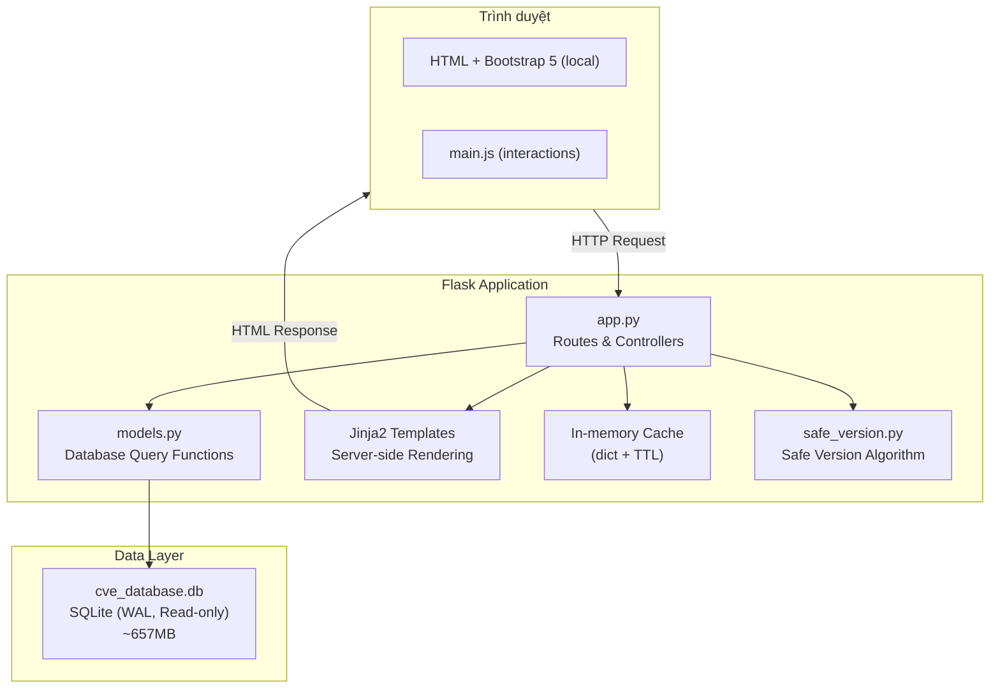
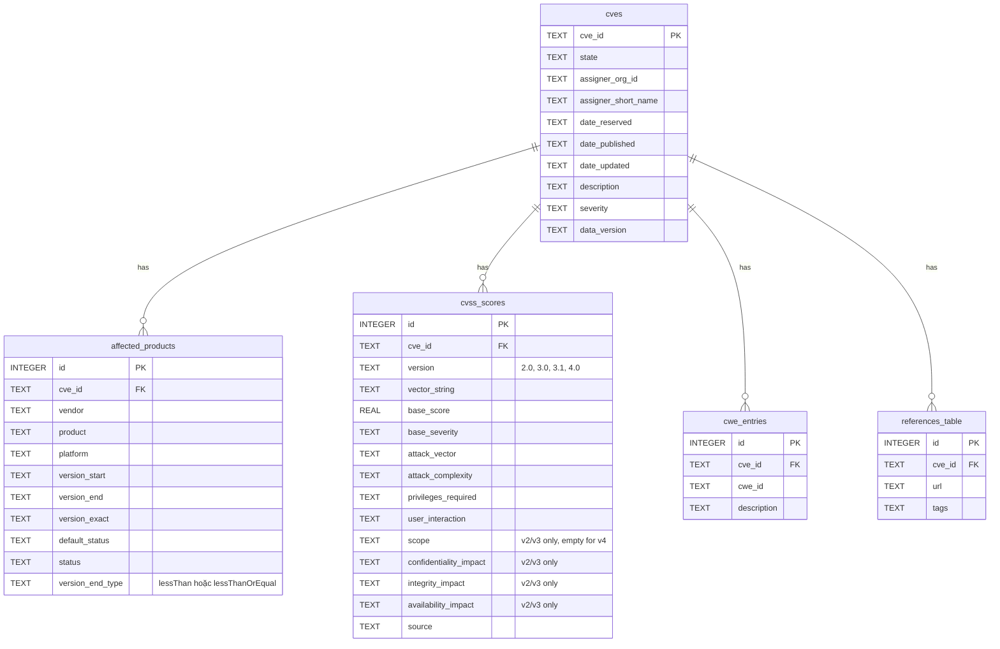
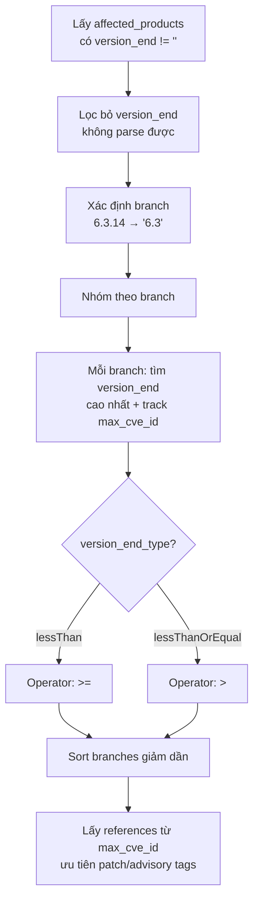

# Tài liệu Thiết kế — Secure Software Board

## Tổng quan

Secure Software Board là ứng dụng web Flask server-side rendering, cho phép tra cứu ~346,000 lỗ hổng bảo mật (CVE) từ cơ sở dữ liệu SQLite 657MB đã được import sẵn. Ứng dụng cung cấp nhiều góc nhìn duyệt dữ liệu (theo vendor, product, severity, CWE, ngày, assigner), tìm kiếm với wildcard, gợi ý phiên bản an toàn với URL references, danh sách phiên bản sản phẩm với lỗ hổng theo version, và hỗ trợ hiển thị CVSS v2/v3/v4.

Kiến trúc tuân theo mô hình MVC đơn giản: Flask routes (Controller) → models.py (Model) → Jinja2 templates (View), với SQLite read-only làm data store. Không sử dụng ORM — truy vấn SQL trực tiếp qua module `sqlite3`. Bootstrap 5 CSS/JS/Icons được serve từ local (`static/`) thay vì CDN.

## Kiến trúc

### Sơ đồ kiến trúc tổng thể



### Quyết định kiến trúc

| Quyết định | Lựa chọn | Lý do |
|---|---|---|
| Không dùng ORM | Raw SQL qua sqlite3 | Dataset lớn (346K CVE, 1.1M products), cần kiểm soát query chính xác |
| Server-side rendering | Jinja2 + Bootstrap 5 | Đơn giản, SEO-friendly, không cần API riêng cho SPA |
| Bootstrap local | `static/css/`, `static/js/` | Tránh phụ thuộc CDN, hoạt động offline |
| In-memory cache | Dict + TTL tự implement | Đơn giản, đủ cho single-process Flask |
| Read-only SQLite + WAL | `file:cve_database.db?mode=ro` | Dữ liệu tĩnh, WAL cho phép đọc đồng thời |
| Safe version tách module | `safe_version.py` | Logic phức tạp (semver, branch grouping), dễ test độc lập |
| Version sort trong Python | `parse_version()` + sort | SQLite không hỗ trợ semver sort natively |

## Thành phần và Giao diện

### 1. `app.py` — Flask Application & Routes

```python
# Routes
@app.route('/')                                                    # Homepage
@app.route('/cves')                                                # CVE list + filters
@app.route('/cves/<cve_id>')                                       # CVE detail (CVSS v2/v3/v4)
@app.route('/cves/by-date')                                        # Browse by date
@app.route('/cves/by-type')                                        # Browse by CWE
@app.route('/cves/by-severity')                                    # Browse by severity
@app.route('/assigners')                                           # Assigners list
@app.route('/assigners/<assigner>')                                # Assigner detail
@app.route('/vendors')                                             # Vendors A-Z
@app.route('/vendors/<vendor>')                                    # Vendor detail
@app.route('/products')                                            # Products browse
@app.route('/products/<vendor>/<product>')                         # Product detail (3 tabs)
@app.route('/products/<vendor>/<product>/versions/<version>')      # Version detail
@app.route('/products/<vendor>/<product>/fixed/<branch>')          # Fixed CVEs by branch
@app.route('/search')                                              # Search
```

### 2. `models.py` — Database Query Functions

```python
# Pagination
def get_paginated_result(db, query, count_query, params, page, per_page=50) -> dict

# Homepage
def get_stats(db) -> dict                    # Thống kê tổng quan (cached 1h)
def get_latest_cves(db, limit=10) -> list    # CVE mới nhất

# CVE
def get_cves(db, page, year, severity) -> dict
def get_cve_detail(db, cve_id) -> dict | None
def get_cve_cvss(db, cve_id) -> list         # Hỗ trợ CVSS v2/v3/v4
def get_cve_affected(db, cve_id) -> list
def get_cve_cwes(db, cve_id) -> list
def get_cve_references(db, cve_id) -> list

# Browse
def get_years_with_counts(db) -> list        # Cached 1h
def get_months_for_year(db, year) -> list
def get_cves_by_month(db, year, month, page) -> dict
def get_cwe_types(db, page) -> dict          # Cached 1h
def get_cves_by_cwe(db, cwe_id, page) -> dict
def get_severity_summary(db) -> list         # Cached 1h
def get_cves_by_severity(db, severity, page) -> dict
def get_assigners(db, page) -> dict
def get_cves_by_assigner(db, assigner, page) -> dict

# Vendor & Product
def get_vendors(db, letter, search, page) -> dict
def get_vendor_detail(db, vendor) -> dict | None
def get_vendor_products(db, vendor, page) -> dict
def get_products(db, search, page) -> dict
def get_product_detail(db, vendor, product) -> dict | None
def get_product_cves(db, vendor, product, page) -> dict
def get_product_version_ranges(db, vendor, product) -> list

# Product Versions (sorted by semver descending)
def get_product_versions(db, vendor, product) -> list
def get_version_detail(db, vendor, product, version) -> dict | None
def get_version_cves(db, vendor, product, version, page) -> dict

# Fixed CVEs by branch
def get_fixed_cves_by_branch(db, vendor, product, branch, page) -> dict

# Safe Version References (from CVE with highest version_end)
def get_safe_version_references(db, cve_ids, max_refs=5) -> list

# Search
def search_cves(db, cve_id, keyword, vendor, product, page) -> dict | str
```

### 3. `safe_version.py` — Module Gợi ý Phiên bản An toàn

```python
def parse_version(version_str) -> tuple[int, ...] | None
def compare_versions(v1, v2) -> int           # -1, 0, 1
def get_version_branch(version_str) -> str | None

def compute_safe_versions(version_ranges: list[dict]) -> list[dict]:
    """
    Input:  [{'version_end': '6.3.14', 'version_end_type': 'lessThan', 'cve_id': '...'}]
    Output: [{'branch': '6.3', 'safe_version': '6.3.14', 'operator': '>=',
              'cve_count': 5, 'cve_ids': [...], 'max_cve_id': 'CVE-...'}]

    - Branches sorted by version descending (highest first)
    - max_cve_id: CVE with highest version_end (used for references)
    """
```

### 4. Templates & UI

#### Branding: "Secure Software Board"

Tên ứng dụng hiển thị trên sidebar, navbar, và page titles là "Secure Software Board".

#### Sidebar Layout

```
┌─────────────────────────────────────────────────┐
│ Header: Secure Software Board           [Search] │
├──────────┬──────────────────────────────────────┤
│ Sidebar  │                                      │
│          │  Content Area                        │
│ Software │     │
│ Secure   │                                      │
│ Version  │                                      │
│ ├Products│                                      │
│ ├ Vendors│                                      │
│          │                                      │
│ Vulns    │                                      │
│ ├ Browse │                                      │
│ ├ By Date│                                      │
│ ├ By Type│                                      │
│ ├ Severity                                      │
│ ├ Assigners                                     │
│          │                                      │
│ Search   │                                      │
└──────────┴──────────────────────────────────────┘
```

Menu "Software Secure Version" (Products, Vendors) nằm trên "Vulnerabilities".

#### Product Detail — 3 Tabs

Trang `/products/<vendor>/<product>` sử dụng Bootstrap 5 tabs:

1. **Phiên bản an toàn được gợi ý** (mặc định, active)
   - Bảng: Branch | Safe Version | Lỗ hổng đã fix (link đến `/fixed/<branch>`) | References
   - References lấy từ CVE có `version_end` cao nhất trong branch (`max_cve_id`)
   - Ưu tiên URL có tag: patch, vendor-advisory, release-notes, fix
   - Tối đa 5 references mỗi branch
   - Branches sắp xếp theo version giảm dần

2. **Danh sách phiên bản**
   - Bảng: Version (link đến `/versions/<version>`) | CVE Count
   - Sắp xếp theo semver giảm dần (parse_version + Python sort)
   - Hiển thị tối đa 20 phiên bản

3. **Vulnerabilities**
   - Bảng CVE: CVE ID | Description | Severity | CVSS | Date
   - Phân trang 50/trang

#### CVSS Display — Hỗ trợ v2/v3/v4

Template `cve_detail.html` hiển thị bảng CVSS khác nhau tùy version:

- **CVSS v2/v3**: Attack Vector | Complexity | Privileges | User Interaction | Scope | C | I | A
- **CVSS v4**: Attack Vector | Complexity | Attack Req. | Privileges | User Interaction | Vuln. C/I/A | Subseq. C/I/A

CVSS v4 metrics được parse từ vector string (AV, AC, AT, PR, UI, VC/VI/VA, SC/SI/SA).

#### Component Templates

- `components/sidebar.html` — Sidebar navigation, nhận `active_page`
- `components/pagination.html` — Pagination, nhận `pagination` dict
- `components/cvss_badge.html` — CVSS score badge với color mapping

### 5. Static Assets (Local)

Bootstrap 5 CSS, JS, và Icons được serve từ local thay vì CDN:
- `static/css/bootstrap.min.css`
- `static/css/bootstrap-icons.min.css`
- `static/css/fonts/bootstrap-icons.woff2`
- `static/js/bootstrap.bundle.min.js`
- `static/css/style.css` — Custom styles
- `static/js/main.js` — Minimal JS


## Mô hình Dữ liệu

### Sơ đồ ERD



### Thuật toán Safe Version Suggestion



References cho mỗi branch lấy từ CVE có `version_end` cao nhất (`max_cve_id`), đảm bảo references liên quan đến bản fix mới nhất.

### CVSS v4 Metrics (từ vector string)

| Metric | Tên đầy đủ | Giá trị |
|---|---|---|
| AV | Attack Vector | N/A/L/P |
| AC | Attack Complexity | L/H |
| AT | Attack Requirements | N/P |
| PR | Privileges Required | N/L/H |
| UI | User Interaction | N/P/A |
| VC | Vulnerable Confidentiality | N/L/H |
| VI | Vulnerable Integrity | N/L/H |
| VA | Vulnerable Availability | N/L/H |
| SC | Subsequent Confidentiality | N/L/H |
| SI | Subsequent Integrity | N/L/H |
| SA | Subsequent Availability | N/L/H |

### CVSS Badge Color Mapping

| Score Range | Severity | Màu CSS |
|---|---|---|
| 9.0 – 10.0 | CRITICAL | `#d32f2f` (đỏ) |
| 7.0 – 8.9 | HIGH | `#f57c00` (cam) |
| 4.0 – 6.9 | MEDIUM | `#fbc02d` (vàng) |
| 0.1 – 3.9 | LOW | `#388e3c` (xanh lá) |
| N/A | N/A | `#757575` (xám) |

## Xử lý Lỗi

| Tầng | Loại lỗi | Xử lý |
|---|---|---|
| Route | Tham số không hợp lệ | Giá trị mặc định (page=1, severity=None) |
| Route | Resource không tìm thấy | Trang 404 tùy chỉnh |
| Model | Database query lỗi | Log error, Flask xử lý 500 |
| App | Database file không tồn tại | Trang lỗi 503 |
| Safe Version | Version không parse được | Bỏ qua, tiếp tục |

## Chiến lược Testing

- **70 tests** tổng cộng (unit + property-based)
- **Unit tests**: pytest + Flask test client, SQLite in-memory fixture (~500 CVE records)
- **Property-based tests**: hypothesis, 21 properties, mỗi property 100-200 iterations
- **Test files**: `tests/test_cache.py`, `tests/test_models.py`, `tests/test_prop_*.py`
