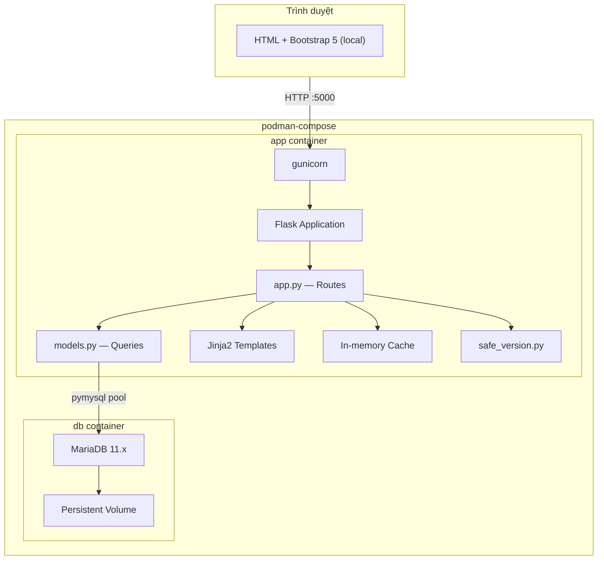
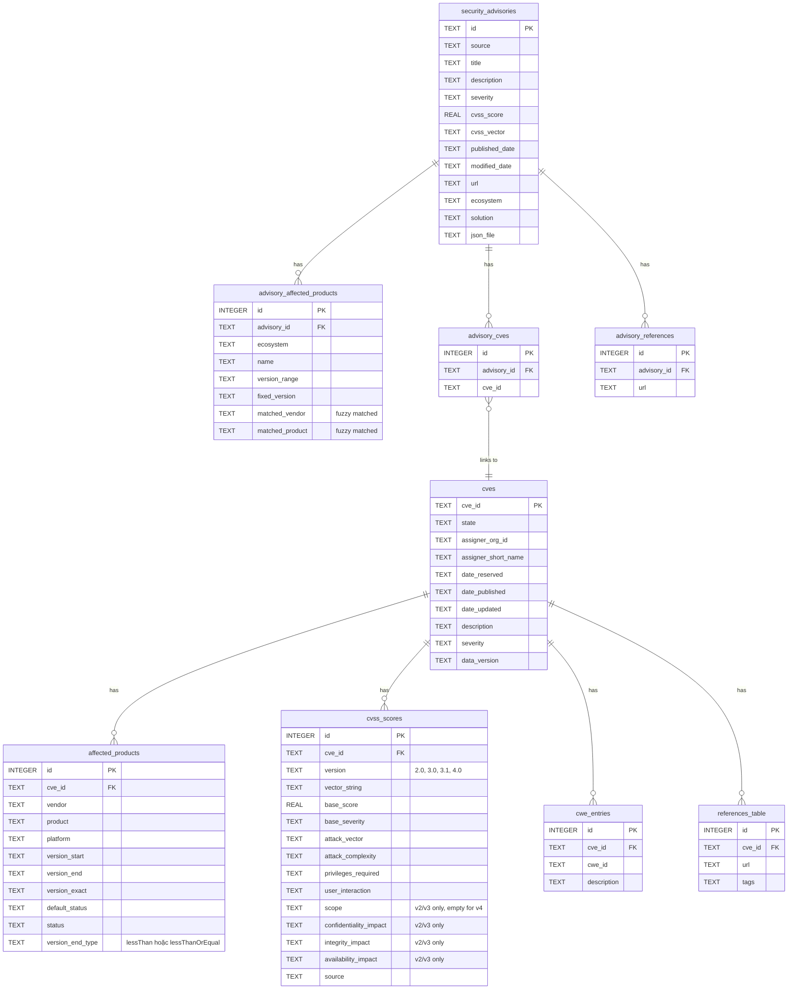
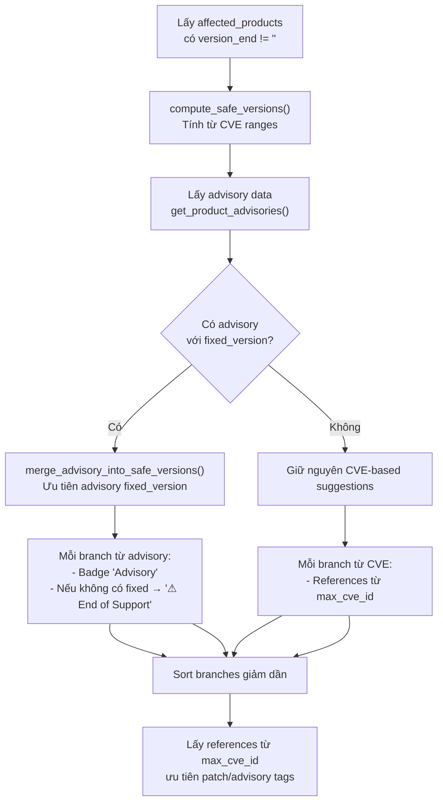
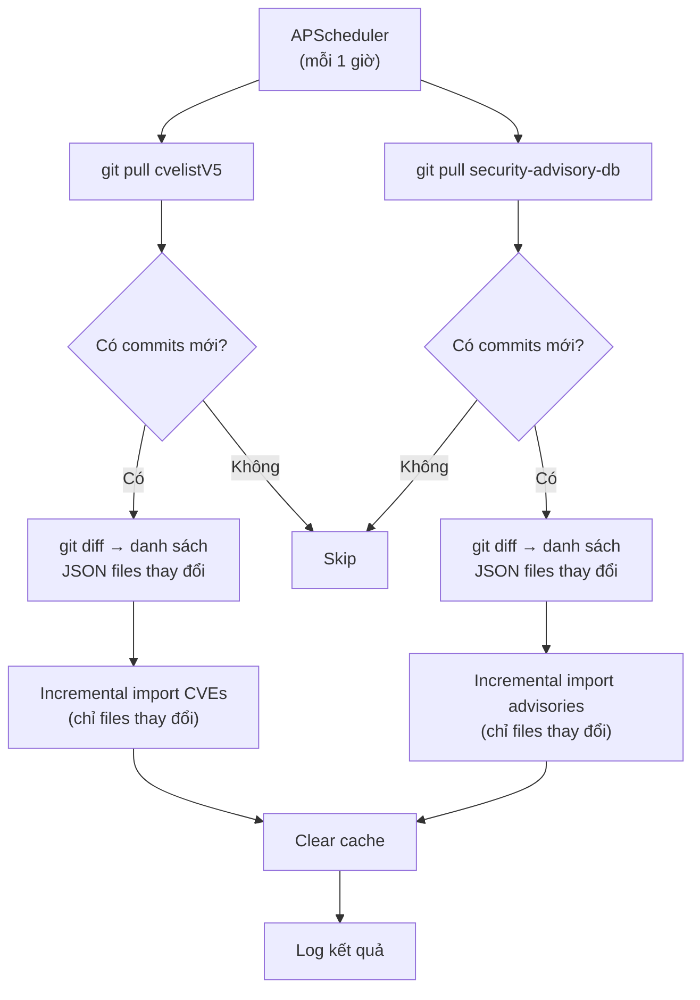

# Tài liệu Thiết kế — Secure Software Board

## Tổng quan

Secure Software Board là ứng dụng web Flask server-side rendering, cho phép tra cứu ~346,000 lỗ hổng bảo mật (CVE) và 839 security advisories từ 27 nguồn (Cisco, GitLab, Jenkins, Spring, AWS, ...) trong cơ sở dữ liệu MariaDB. Ứng dụng cung cấp:

- Duyệt CVE theo vendor, product, severity, CWE, ngày, assigner
- Tìm kiếm với wildcard
- Gợi ý phiên bản an toàn tích hợp advisory data (ưu tiên fixed_version từ advisory, cảnh báo End of Support)
- Danh sách phạm vi phiên bản bị ảnh hưởng với link đến CVE list
- Security advisories browser (danh sách + chi tiết, lọc theo source/severity)
- Hỗ trợ hiển thị CVSS v2/v3/v4
- Fuzzy matching ecosystem/name → vendor/product (ngưỡng 90%)

Kiến trúc tuân theo mô hình MVC đơn giản: Flask routes (Controller) → models.py (Model) → Jinja2 templates (View), với MariaDB làm data store (chuyển từ SQLite). Sử dụng `pymysql` với connection pooling. Bootstrap 5 CSS/JS/Icons được serve từ local (`static/`). Triển khai bằng podman-compose với 2 containers: app (Flask + gunicorn) và db (MariaDB).

## Kiến trúc

### Sơ đồ kiến trúc tổng thể



### Quyết định kiến trúc

| Quyết định | Lựa chọn | Lý do |
|---|---|---|
| Không dùng ORM | Raw SQL qua pymysql | Kiểm soát query chính xác, tận dụng index |
| Database | MariaDB 11.x (container) | Production-ready, concurrent access, scalable |
| DB driver | pymysql + connection pooling | Pure Python, pool cho performance |
| Server-side rendering | Jinja2 + Bootstrap 5 | Đơn giản, SEO-friendly |
| Bootstrap local | `static/css/`, `static/js/` | Tránh phụ thuộc CDN, hoạt động offline |
| In-memory cache | Dict + TTL tự implement | Đơn giản, đủ cho single-process |
| Container | podman-compose (2 services) | Portable, rootless, tương thích docker-compose |
| WSGI server | gunicorn | Production-grade, multi-worker |
| Safe version tách module | `safe_version.py` | Logic phức tạp, dễ test độc lập |
| Advisory fuzzy match | `difflib.SequenceMatcher` >= 90% | Tự động match ecosystem/name → vendor/product |
| Version sort trong Python | `parse_version()` + sort | MariaDB không hỗ trợ semver sort natively |

## Thành phần và Giao diện

### Kiến trúc MVC

```
src/
├── app.py              # App factory (create_app)
├── config.py           # Configuration class
├── database.py         # DB connection pool, SimpleCache
├── filters.py          # Jinja2 template filters
├── safe_version.py     # Safe version business logic
├── controllers/        # Route handlers (Flask Blueprints)
│   ├── __init__.py     # Blueprint registry
│   ├── main.py         # Homepage (/)
│   ├── cves.py         # CVE list + detail (/cves)
│   ├── browse.py       # By date/type/severity/assigner
│   ├── vendors.py      # Vendor list + detail (/vendors)
│   ├── products.py     # Product detail/versions/fixed (/products)
│   ├── search.py       # Search (/search)
│   └── advisories.py   # Advisory list + detail (/advisories)
├── models/             # Database query functions
│   ├── __init__.py     # Re-exports all functions
│   ├── helpers.py      # _fetchone, sanitize_*, pagination
│   ├── cves.py         # CVE table queries
│   ├── browse.py       # Browse queries (date, CWE, severity, assigner)
│   ├── vendors.py      # Vendor + product table queries
│   ├── products.py     # Version, fixed CVEs queries
│   ├── search.py       # Search queries
│   └── advisories.py   # Advisory table queries
├── templates/          # Jinja2 templates (View)
│   ├── components/     # Reusable components
│   └── *.html          # Page templates
└── static/             # CSS, JS, fonts (Bootstrap local)
```

```python
# Routes
@app.route('/')                                                    # Homepage
@app.route('/cves')                                                # CVE list + filters
@app.route('/cves/<cve_id>')                                       # CVE detail (CVSS v2/v3/v4)
@app.route('/cves/by-date')                                        # Browse by date
@app.route('/cves/by-type')                                        # Browse by CWE
@app.route('/cves/by-severity')                                    # Browse by severity
@app.route('/assigners')                                           # Assigners list
@app.route('/assigners/<assigner>')                                # Assigner detail
@app.route('/vendors')                                             # Vendors A-Z
@app.route('/vendors/<vendor>')                                    # Vendor detail
@app.route('/products')                                            # Products browse
@app.route('/products/<vendor>/<product>')                         # Product detail (3 tabs)
@app.route('/products/<vendor>/<product>/versions/<version>')      # Version detail
@app.route('/products/<vendor>/<product>/fixed/<branch>')          # Fixed CVEs by branch
@app.route('/advisories')                                          # Advisory list + filters
@app.route('/advisories/<id>')                                     # Advisory detail
@app.route('/search')                                              # Search
```

### 2. `models.py` — Database Query Functions

```python
# Pagination
def get_paginated_result(db, query, count_query, params, page, per_page=50) -> dict

# Homepage
def get_stats(db) -> dict                    # Thống kê tổng quan (cached 1h)
def get_latest_cves(db, limit=10) -> list    # CVE mới nhất

# CVE
def get_cves(db, page, year, severity) -> dict
def get_cve_detail(db, cve_id) -> dict | None
def get_cve_cvss(db, cve_id) -> list         # Hỗ trợ CVSS v2/v3/v4
def get_cve_affected(db, cve_id) -> list
def get_cve_cwes(db, cve_id) -> list
def get_cve_references(db, cve_id) -> list

# Browse
def get_years_with_counts(db) -> list        # Cached 1h
def get_months_for_year(db, year) -> list
def get_cves_by_month(db, year, month, page) -> dict
def get_cwe_types(db, page) -> dict          # Cached 1h
def get_cves_by_cwe(db, cwe_id, page) -> dict
def get_severity_summary(db) -> list         # Cached 1h
def get_cves_by_severity(db, severity, page) -> dict
def get_assigners(db, page) -> dict
def get_cves_by_assigner(db, assigner, page) -> dict

# Vendor & Product
def get_vendors(db, letter, search, page) -> dict
def get_vendor_detail(db, vendor) -> dict | None
def get_vendor_products(db, vendor, page) -> dict
def get_products(db, search, page) -> dict
def get_product_detail(db, vendor, product) -> dict | None
def get_product_cves(db, vendor, product, page) -> dict
def get_product_version_ranges(db, vendor, product) -> list

# Product Versions (sorted by semver descending)
def get_product_versions(db, vendor, product) -> list
def get_version_detail(db, vendor, product, version) -> dict | None
def get_version_cves(db, vendor, product, version, page) -> dict

# Fixed CVEs by branch
def get_fixed_cves_by_branch(db, vendor, product, branch, page) -> dict

# Safe Version References (from CVE with highest version_end)
def get_safe_version_references(db, cve_ids, max_refs=5) -> list

# Search
def search_cves(db, cve_id, keyword, vendor, product, page) -> dict | str

# Security Advisories
def get_advisories(db, page, source=None, severity=None) -> dict
def get_advisory_sources(db) -> list[dict]
def get_advisory_detail(db, advisory_id) -> dict | None
def get_advisory_affected(db, advisory_id) -> list[dict]
def get_advisory_cves(db, advisory_id) -> list[dict]
def get_advisory_refs(db, advisory_id) -> list[str]
def get_product_advisories(db, vendor, product) -> list[dict]
```

### 3. `safe_version.py` — Module Gợi ý Phiên bản An toàn

```python
def parse_version(version_str) -> tuple[int, ...] | None
def compare_versions(v1, v2) -> int           # -1, 0, 1
def get_version_branch(version_str) -> str | None

def compute_safe_versions(version_ranges: list[dict]) -> list[dict]:
    """
    Input:  [{'version_end': '6.3.14', 'version_end_type': 'lessThan', 'cve_id': '...'}]
    Output: [{'branch': '6.3', 'safe_version': '6.3.14', 'operator': '>=',
              'cve_count': 5, 'cve_ids': [...], 'max_cve_id': 'CVE-...'}]

    - Branches sorted by version descending (highest first)
    - max_cve_id: CVE with highest version_end (used for references)
    """

def merge_advisory_into_safe_versions(safe_versions, advisories) -> list[dict]:
    """Merge advisory fixed_version data into safe version suggestions.

    If advisories have fixed_version → override with advisory-based branches.
    Adds 'from_advisory' flag, 'end_of_support' warning for branches without fix.
    Falls back to CVE-based computation if no advisory data.
    """
```

### 4. Templates & UI

#### Branding: "Secure Software Board"

Tên ứng dụng hiển thị trên sidebar, navbar, và page titles là "Secure Software Board".

#### Sidebar Layout

```
┌─────────────────────────────────────────────────┐
│ Header: Secure Software Board           [Search] │
├──────────┬──────────────────────────────────────┤
│ Sidebar  │                                      │
│          │  Content Area                        │
│ Search   │     │
│          │                                      │
│ Software │                                      │
│ Secure   │                                      │
│ Version  │                                      │
│ ├Products│                                      │
│ ├ Vendors│                                      │
│          │                                      │
│ Advisories                                      │
│ ├ Security│                                     │
│   Advisories                                    │
│          │                                      │
│ Vulns    │                                      │
│ ├ Browse │                                      │
│ ├ By Date│                                      │
│ ├ By Type│                                      │
│ ├ Severity                                      │
│ ├ Assigners                                     │
└──────────┴──────────────────────────────────────┘
```

Menu "Software Secure Version" (Products, Vendors) nằm trên "Vulnerabilities".

#### Product Detail — 3 Tabs

Trang `/products/<vendor>/<product>` sử dụng Bootstrap 5 tabs:

1. **Phiên bản an toàn được gợi ý** (mặc định, active)
   - Bảng: Branch | Safe Version | Lỗ hổng đã fix (link đến `/fixed/<branch>`) | References
   - References lấy từ CVE có `version_end` cao nhất trong branch (`max_cve_id`)
   - Ưu tiên URL có tag: patch, vendor-advisory, release-notes, fix
   - Tối đa 5 references mỗi branch
   - Branches sắp xếp theo version giảm dần

2. **Danh sách phiên bản**
   - Bảng: Version (link đến `/versions/<version>`) | CVE Count
   - Sắp xếp theo semver giảm dần (parse_version + Python sort)
   - Hiển thị tối đa 20 phiên bản

3. **Vulnerabilities**
   - Bảng CVE: CVE ID | Description | Severity | CVSS | Date
   - Phân trang 50/trang

#### CVSS Display — Hỗ trợ v2/v3/v4

Template `cve_detail.html` hiển thị bảng CVSS khác nhau tùy version:

- **CVSS v2/v3**: Attack Vector | Complexity | Privileges | User Interaction | Scope | C | I | A
- **CVSS v4**: Attack Vector | Complexity | Attack Req. | Privileges | User Interaction | Vuln. C/I/A | Subseq. C/I/A

CVSS v4 metrics được parse từ vector string (AV, AC, AT, PR, UI, VC/VI/VA, SC/SI/SA).

#### Component Templates

- `components/sidebar.html` — Sidebar navigation, nhận `active_page`
- `components/pagination.html` — Pagination, nhận `pagination` dict
- `components/cvss_badge.html` — CVSS score badge với color mapping

### 5. Static Assets (Local)

Bootstrap 5 CSS, JS, và Icons được serve từ local thay vì CDN:
- `static/css/bootstrap.min.css`
- `static/css/bootstrap-icons.min.css`
- `static/css/fonts/bootstrap-icons.woff2`
- `static/js/bootstrap.bundle.min.js`
- `static/css/style.css` — Custom styles
- `static/js/main.js` — Minimal JS


## Mô hình Dữ liệu

### Sơ đồ ERD



### Thuật toán Safe Version Suggestion



References cho mỗi branch lấy từ CVE có `version_end` cao nhất (`max_cve_id`), đảm bảo references liên quan đến bản fix mới nhất.

### CVSS v4 Metrics (từ vector string)

| Metric | Tên đầy đủ | Giá trị |
|---|---|---|
| AV | Attack Vector | N/A/L/P |
| AC | Attack Complexity | L/H |
| AT | Attack Requirements | N/P |
| PR | Privileges Required | N/L/H |
| UI | User Interaction | N/P/A |
| VC | Vulnerable Confidentiality | N/L/H |
| VI | Vulnerable Integrity | N/L/H |
| VA | Vulnerable Availability | N/L/H |
| SC | Subsequent Confidentiality | N/L/H |
| SI | Subsequent Integrity | N/L/H |
| SA | Subsequent Availability | N/L/H |

### CVSS Badge Color Mapping

| Score Range | Severity | Màu CSS |
|---|---|---|
| 9.0 – 10.0 | CRITICAL | `#d32f2f` (đỏ) |
| 7.0 – 8.9 | HIGH | `#f57c00` (cam) |
| 4.0 – 6.9 | MEDIUM | `#fbc02d` (vàng) |
| 0.1 – 3.9 | LOW | `#388e3c` (xanh lá) |
| N/A | N/A | `#757575` (xám) |

## Xử lý Lỗi

| Tầng | Loại lỗi | Xử lý |
|---|---|---|
| Route | Tham số không hợp lệ | Giá trị mặc định (page=1, severity=None) |
| Route | Resource không tìm thấy | Trang 404 tùy chỉnh |
| Model | Database query lỗi | Log error, Flask xử lý 500 |
| App | Database file không tồn tại | Trang lỗi 503 |
| Safe Version | Version không parse được | Bỏ qua, tiếp tục |

## Chiến lược Testing

- **70 tests** tổng cộng (unit + property-based)
- **Unit tests**: pytest + Flask test client, SQLite in-memory fixture (~500 CVE records)
- **Property-based tests**: hypothesis, 21 properties, mỗi property 100-200 iterations
- **Test files**: `tests/test_cache.py`, `tests/test_models.py`, `tests/test_prop_*.py`

## Import Scripts

### `scripts/import_cves.py`
Import CVE data từ cvelistV5 JSON files vào `cve_database.db`. Bao gồm cột `version_end_type`.

### `scripts/import_advisories.py`
Import security advisory JSON files từ `/Volumes/DATA/security_advisory/data/` vào `cve_database.db`:
- Đọc 839 advisory files từ 27 nguồn
- Fuzzy match ecosystem/name → vendor/product (ngưỡng 90%, `difflib.SequenceMatcher`)
- Nếu không match → tạo entry mới với ecosystem/name
- Tạo 4 bảng: `security_advisories`, `advisory_affected_products`, `advisory_cves`, `advisory_references`
- Kết quả: 17,596 matched products, 245 new products


## Triển khai Container

### Kiến trúc Container

```
podman-compose up -d
├── app (Flask + gunicorn)
│   ├── Dockerfile (Python 3.11-slim)
│   ├── gunicorn --bind 0.0.0.0:5000 --workers 4
│   ├── depends_on: db (healthy)
│   └── env: DB_HOST, DB_PORT, DB_USER, DB_PASSWORD, DB_NAME
└── db (MariaDB 11.x)
    ├── port: 3306
    ├── volume: mariadb_data:/var/lib/mysql
    ├── healthcheck: mysqladmin ping
    └── env: MARIADB_ROOT_PASSWORD, MARIADB_DATABASE, MARIADB_USER, MARIADB_PASSWORD
```

### Files

| File | Mô tả |
|---|---|
| `Dockerfile` | Build Flask app image, cài pymysql + gunicorn |
| `docker-compose.yml` | 2 services: app + db, tương thích podman-compose |
| `.env.example` | Mẫu environment variables |
| `scripts/migrate_to_mysql.py` | Migrate dữ liệu từ SQLite → MariaDB |
| `scripts/init_db.sh` | Khởi tạo schema + import data lần đầu |

### Database Connection

```python
# app.py — MariaDB connection pool
import pymysql
from dbutils.pooled_db import PooledDB

pool = PooledDB(
    creator=pymysql,
    host=os.environ.get('DB_HOST', 'localhost'),
    port=int(os.environ.get('DB_PORT', 3306)),
    user=os.environ.get('DB_USER', 'cvedb'),
    password=os.environ.get('DB_PASSWORD', 'cvedb'),
    database=os.environ.get('DB_NAME', 'cve_database'),
    charset='utf8mb4',
    cursorclass=pymysql.cursors.DictCursor,
    maxconnections=10,
)
```

### SQL Syntax Changes (SQLite → MariaDB)

| SQLite | MariaDB |
|---|---|
| `?` placeholder | `%s` placeholder |
| `GLOB '[0-9]*'` | `REGEXP '^[0-9]'` |
| `LIKE ? ESCAPE '\'` | `LIKE %s ESCAPE '\\'` |
| `sqlite3.Row` → dict | `DictCursor` → dict natively |
| `SUBSTR(col, 1, 4)` | `SUBSTRING(col, 1, 4)` hoặc `LEFT(col, 4)` |
| `file:db?mode=ro` URI | Connection pool read/write |
| `PRAGMA journal_mode=WAL` | Không cần (InnoDB default) |


## Scheduled Data Sync

### Kiến trúc Sync



### Components

| File | Mô tả |
|---|---|
| `src/scheduler.py` | APScheduler setup, sync job registration |
| `scripts/sync_cves.py` | Git pull cvelistV5 + incremental import |
| `scripts/sync_advisories.py` | Git pull advisory-db + incremental import |
| `src/controllers/api.py` | `/api/sync/status` endpoint |

### Incremental Import Logic

1. Lưu commit hash trước khi pull (`git rev-parse HEAD`)
2. `git pull --ff-only`
3. Nếu commit hash thay đổi → `git diff --name-only OLD_HASH..HEAD -- '*.json'`
4. Chỉ parse và upsert các file JSON trong danh sách diff
5. Dùng `INSERT ... ON DUPLICATE KEY UPDATE` (MariaDB) hoặc `INSERT OR REPLACE` (SQLite)

### Sync Status Storage

```python
# In-memory sync status (hoặc file-based)
sync_status = {
    'cve': {
        'last_sync': '2025-04-23T10:00:00',
        'next_sync': '2025-04-23T11:00:00',
        'result': 'success',
        'files_changed': 42,
        'records_updated': 38,
    },
    'advisory': { ... }
}
```

### Container Integration

- APScheduler chạy trong cùng process với gunicorn (background thread)
- Git repos được mount hoặc clone vào container volume
- docker-compose.yml thêm volumes cho git repos
